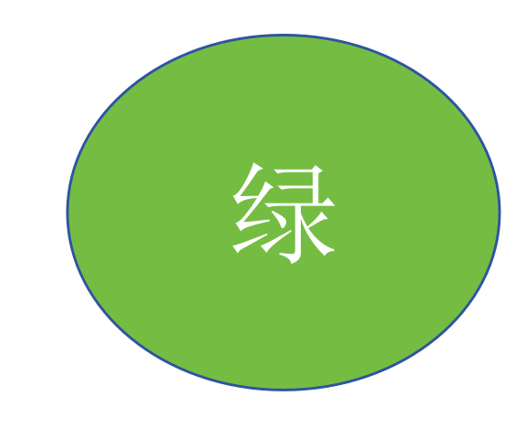

### stroop试验教程
Stroop任务是一种经典的心理学实验，用于研究人们在面对相互冲突的信息时的反应。在Stroop任务中，参与者需要尽可能快地识别文字的颜色，而文字本身的内容可能会与颜色产生冲突。例如，文字“红色”用蓝色墨水打印，参与者需要说出墨水的颜色而不是文字的内容。

使用jsPsych库在线上完成Stroop任务的教程如下：

### 第一步：创建HTML文件

1. **创建基础HTML结构**：
   - 在你的项目文件夹stroop中创建一个HTML文件，例如`stroop.html`，通过`<script>`标签引入jsPsych、插件以及css样式。

```javascript
   ```html
   <!DOCTYPE html>
   <html>
   <head>
       <title>My experiment</title>
      <script src="https://unpkg.com/jspsych@8.0.0"></script>
    <script src="https://unpkg.com/@jspsych/plugin-html-keyboard-response@2.0.0"></script>
    <link href="https://unpkg.com/jspsych@8.0.0/css/jspsych.css" rel="stylesheet" type="text/css" />

   </head>
   <body> </body>
<script>
</script>
   </html>
   ```

### 第二步：显示欢迎进行实验的信息

1. **初始化jsPsych**：
   - 在`stroop.js`文件中，首先初始化jsPsych。

   ```javascript
  /* initialize jsPsych */
    var jsPsych = initJsPsych({
      on_finish: function() {
        jsPsych.data.displayData();
      }
    });
   ```

2. **定义时间线**：
   - 所有jspsych实验都是由时间线定义，一个时间线包含我们想要在实验中运行的一组试验。
- 使用`jsPsych.timeline`来定义试验的顺序和变量。

   ```javascript
   var timeline = [];
   timeline.push(trial);
   ```

3. **创建欢迎信息**：
   - 使用html-keyboard-response插件来创建简单的欢迎信息以问候实验参与者。

   ```javascript
    /* define welcome message trial */
    var welcome = {
      type: jsPsychHtmlKeyboardResponse,
      stimulus: "Welcome to the experiment. Press any key to begin."
    };
    timeline.push(welcome);
   ```

4. **定义试验变量**：
   - 使用`jsPsych.timelineVariable`来定义试验的变量。
   
   ```javascript
     /* define trial stimuli array for timeline variables */
    var test_stimuli = [
      { stimulus: "img/green.png",  correct_response: 'd'},
      { stimulus: "img/green1.png",  correct_response: 'd'},
      { stimulus: "img/red1.png",  correct_response: 'k'},
      { stimulus: "img/red.png",  correct_response: 'k'}
    ];
   ```
### 第三步：上传图片资源

1. **准备图片资源**：
   - 将需要显示的图片上传到你的项目文件夹中的`img`文件夹中。
   - 确保图片文件名与代码中的引用一致。

### 第四步：展示实验指导语

1. **创建新的html-keyboard-response 实验试次**：
   - 这次试验的区别是使用html来展示指导语并将使用post-trial-gap参数在每次试验后添加1.5秒钟的间隙。

    ```javascript
 /* define instructions trial */
    var instructions = {
      type: jsPsychHtmlKeyboardResponse,
      stimulus: `
        <p>In this experiment, a circle will appear in the center 
        of the screen.</p><p>If the word on the circle is <strong>绿</strong>, 
        press the letter D on the keyboard as fast as you can.</p>
        <p>If the word on the circle is <strong>红</strong>, press the letter K
        as fast as you can.</p>
        <div style='width: 700px;'>
        <div style='flex-container;'></img>
        <p class='small'><strong>Press the D key</strong></p></div>
        <div style='flex-container;'></img>
        <p class='small'><strong>Press the D key</strong></p></div>
        <div style='flex-container;'></img>
        <p class='small'><strong>Press the K key</strong></p></div>
        <div style='flex-container;'></img>
        <p class='small'><strong>Press the K key</strong></p></div>
        </div>
        <p>Press any key to begin.</p>
      `,
      post_trial_gap: 1500
    };
    timeline.push(instructions);
   ```


### 第五步：显示刺激并作出相应按键反应

1. **创建刺激**：
   - 创建试验来显示刺激在概念上与创建试验来显示指令相同，只是现在我们要显示图像而不是文本或html,所以我们需要使用不同的插件即image-keyboard-response,并通过添加`<script>`标签来引入该插件。

```javascript
   <script src="https://unpkg.com/jspsych@8.0.0"></script>
    <script src="https://unpkg.com/@jspsych/plugin-html-keyboard-response@2.0.0"></script>
    <script src="https://unpkg.com/@jspsych/plugin-image-keyboard-response@2.0.0"></script>
    <script src="https://unpkg.com/@jspsych/plugin-preload@2.0.0"></script>
    <link href="https://unpkg.com/jspsych@8.0.0/css/jspsych.css" rel="stylesheet" type="text/css" />
   ```
   - 同时我们还需要设置每张图片出现时被试应该使用哪些键来进行反应，本实验中主要使用D和K键来进行反应。

 ```javascript
      var test = {
      type: jsPsychImageKeyboardResponse,
      stimulus: jsPsych.timelineVariable('stimulus'),
      choices: ['d', 'k'],
      data: {
        task: 'response',
        correct_response: jsPsych.timelineVariable('correct_response')
      },
      on_finish: function(data){
        data.correct = jsPsych.pluginAPI.compareKeys(data.response, data.correct_response);
      }
    };
 ```

### 第六步：预加载实验图片或其他媒体元素

1. **预加载**：
   - 每当我们在实验中需要使用媒体元素如图像、音频、视频时，最好在进行实验前预加载它们。
   -使用预加载插件来预加载这四个图像，并将预加载插件添加到<head>部分。

 ```javascript
<script src="https://unpkg.com/@jspsych/plugin-preload@2.0.0"></script>
 ```

### 第七步：带有时间线变量的时间线参数

1. **优化实验顺序**：
   - 使用时间线变量来随机化图片出现的顺序并重复试验。只需要在有time-variables的对象上设置randomize-order: true:
   - 我们还可以通过设置重复参数来轻松地延长测试阶段。此参数控制实验将循环遍及timeline_variables数组中所有条目的次数。例如，如果我们设置重复：10，那么实验将循环通过timeline_variables中的四个条目10次，总共40次测试试验。

```javascript
/* define test procedure */
    var test_procedure = {
      timeline: [fixation, test],
      timeline_variables: test_stimuli,
      repetitions: 10,
      randomize_order: true
    };
    timeline.push(test_procedure);
 ```
### 第八步：使用函数生成参数
  - 改进固定交叉的持续时间，可以通过在每个试验的固定试验中对trial_duration参数使用不同的值来改变这一点。 一种选择是添加另一个时间线变量，如“fixation_duration”，并使用它来控制时间。 但另一种选择是将trial_duration参数指定为函数。 如果参数是函数，jsPsych将在每次试用运行时执行该函数。 这意味着，如果函数在概率上返回不同的结果，我们可以在每次运行试验时获得不同的参数值。

在这里，我们将使用jsPsych的随机化模块中内置的随机化方法之一。jsPsych.randomization.sampleWithoutReplacement（）取一个要采样的项目数组，并通过采样而不替换生成一个长度为N的新数组。

```javascript
/* define fixation and test trials */
    var fixation = {
      type: jsPsychHtmlKeyboardResponse,
      stimulus: '<div style="font-size:60px;">+</div>',
      choices: "NO_KEYS",
      trial_duration: function(){
        return jsPsych.randomization.sampleWithoutReplacement([250, 500, 750, 1000, 1250, 1500, 1750, 2000], 1)[0];
      },
      data: {
        task: 'fixation'
      }
    };
```
在上面的代码中，我们将固定中的trial_duration：1000参数替换为函数。在函数内部，我们从大小为1的数组[250，500，750，1000，1250，1500，1750，2000]中取一个样本（第二个参数到jsPsych.randomization.sampleWithoutReplacement）。调用jsPsych.randomization.sampleWithoutReplacement的返回值是一个长度为1的数组，因此我们在末尾添加[0]选择，以从数组中获取值。

### 第九步：数据分析
-jsPsych提供了有限的分析功能，允许您计算一组选定试验的平均响应时间。在这一部分中，我们将使用这些功能在实验中添加到最终试验，告诉参与者其准确性和正确响应的平均响应时间。

-我们将使用html-keyboard-response插件。由于我们想要显示的文本根据参与者在实验中的表现而变化，我们需要为刺激参数使用一个函数并得到所需的文本。

```javascript
/* define debrief */
    var debrief_block = {
      type: jsPsychHtmlKeyboardResponse,
      stimulus: function() {

        var trials = jsPsych.data.get().filter({task: 'response'});
        var correct_trials = trials.filter({correct: true});
        var accuracy = Math.round(correct_trials.count() / trials.count() * 100);
        var rt = Math.round(correct_trials.select('rt').mean());

        return `<p>You responded correctly on ${accuracy}% of the trials.</p>
          <p>Your average response time was ${rt}ms.</p>
          <p>Press any key to complete the experiment. Thank you!</p>`;

      }
    };
    timeline.push(debrief_block);
```
为了创建变量试验，我们使用jsPsych.data.get()，它返回一个包含实验所有数据的jsPsych数据集合。然后，我们可以使用.filter仅选择任务为“响应”的试验。试验包含显示圆圈的试验的所有数据。

为了只获得正确的试验，我们可以再次使用.filter()仅从属性正确的试验数据收集中选择试验。

为了计算准确性，我们可以使用.count()方法来确定有多少试验是正确的，总共有多少试验。我们还使用Math.round（）来避免小数点后出现额外的数字。

最后，为了计算正确试验的平均响应时间，我们使用 correct_trials 数据收集上的 .select 方法，仅选择这些试验的“rt”属性。然后，我们可以使用.mean()方法来找到所有RT值的均值。

### 第十步：最终代码

```javascript
<!DOCTYPE html>
<html>
  <head>
    <title>My experiment</title>
    <script src="https://unpkg.com/jspsych@8.0.0"></script>
    <script src="https://unpkg.com/@jspsych/plugin-html-keyboard-response@2.0.0"></script>
    <script src="https://unpkg.com/@jspsych/plugin-image-keyboard-response@2.0.0"></script>
    <script src="https://unpkg.com/@jspsych/plugin-preload@2.0.0"></script>
    <link href="https://unpkg.com/jspsych@8.0.0/css/jspsych.css" rel="stylesheet" type="text/css" />
  </head>
  <body></body>
  <script>

    /* initialize jsPsych */
    var jsPsych = initJsPsych({
      on_finish: function() {
        jsPsych.data.displayData();
      }
    });

    /* create timeline */
    var timeline = [];

    /* preload images */
    var preload = {
      type: jsPsychPreload,
      images: ['img/green.png', 'img/red.png','img/green1.png','img/red1.png']
    };
    timeline.push(preload);

    /* define welcome message trial */
    var welcome = {
      type: jsPsychHtmlKeyboardResponse,
      stimulus: "Welcome to the experiment. Press any key to begin."
    };
    timeline.push(welcome);

    /* define instructions trial */
    var instructions = {
      type: jsPsychHtmlKeyboardResponse,
      stimulus: `
        <p>In this experiment, a circle will appear in the center 
        of the screen.</p><p>If the word on the circle is <strong>绿</strong>, 
        press the letter D on the keyboard as fast as you can.</p>
        <p>If the word on the circle is <strong>红</strong>, press the letter K
        as fast as you can.</p>
        <div style='width: 700px;'>
        <div style='flex-container;'></img>
        <p class='small'><strong>Press the D key</strong></p></div>
        <div style='flex-container;'></img>
        <p class='small'><strong>Press the D key</strong></p></div>
        <div style='flex-container;'></img>
        <p class='small'><strong>Press the K key</strong></p></div>
        <div style='flex-container;'></img>
        <p class='small'><strong>Press the K key</strong></p></div>
        </div>
        <p>Press any key to begin.</p>
      `,
      post_trial_gap: 1500
    };
    timeline.push(instructions);

    /* define trial stimuli array for timeline variables */
    var test_stimuli = [
      { stimulus: "img/green.png",  correct_response: 'd'},
      { stimulus: "img/green1.png",  correct_response: 'd'},
      { stimulus: "img/red1.png",  correct_response: 'k'},
      { stimulus: "img/red.png",  correct_response: 'k'}
    ];

    /* define fixation and test trials */
    var fixation = {
      type: jsPsychHtmlKeyboardResponse,
      stimulus: '<div style="font-size:60px;">+</div>',
      choices: "NO_KEYS",
      trial_duration: function(){
        return jsPsych.randomization.sampleWithoutReplacement([250, 500, 750, 1000, 1250, 1500, 1750, 2000], 1)[0];
      },
      data: {
        task: 'fixation'
      }
    };

    var test = {
      type: jsPsychImageKeyboardResponse,
      stimulus: jsPsych.timelineVariable('stimulus'),
      choices: ['d', 'k'],
      data: {
        task: 'response',
        correct_response: jsPsych.timelineVariable('correct_response')
      },
      on_finish: function(data){
        data.correct = jsPsych.pluginAPI.compareKeys(data.response, data.correct_response);
      }
    };

    /* define test procedure */
    var test_procedure = {
      timeline: [fixation, test],
      timeline_variables: test_stimuli,
      repetitions: 10,
      randomize_order: true
    };
    timeline.push(test_procedure);

    /* define debrief */
    var debrief_block = {
      type: jsPsychHtmlKeyboardResponse,
      stimulus: function() {

        var trials = jsPsych.data.get().filter({task: 'response'});
        var correct_trials = trials.filter({correct: true});
        var accuracy = Math.round(correct_trials.count() / trials.count() * 100);
        var rt = Math.round(correct_trials.select('rt').mean());

        return `<p>You responded correctly on ${accuracy}% of the trials.</p>
          <p>Your average response time was ${rt}ms.</p>
          <p>Press any key to complete the experiment. Thank you!</p>`;

      }
    };
    timeline.push(debrief_block);

    /* start the experiment */
    jsPsych.run(timeline);

  </script>
</html>
```
通过以上步骤，你可以使用jsPsych在线上完成Stroop任务的实验设计。希望这个教程对你有所帮助！

